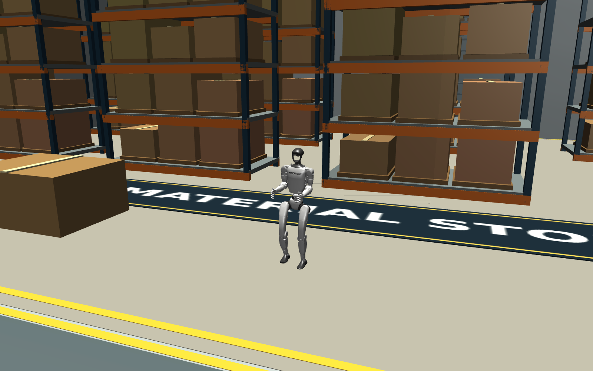
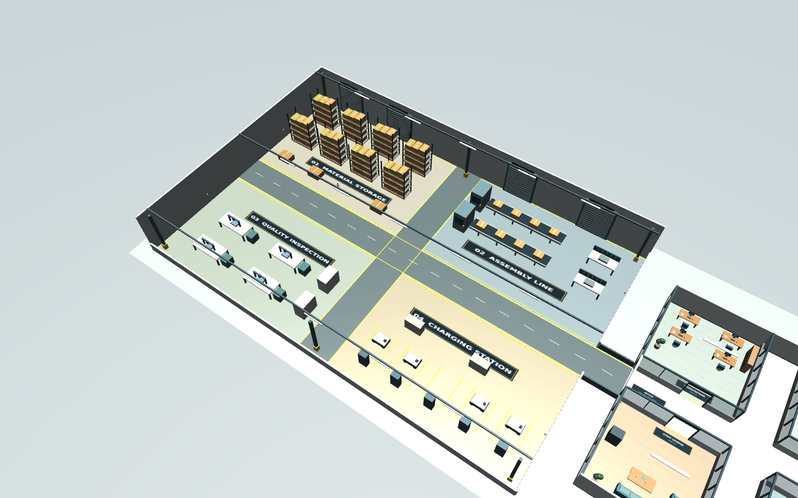
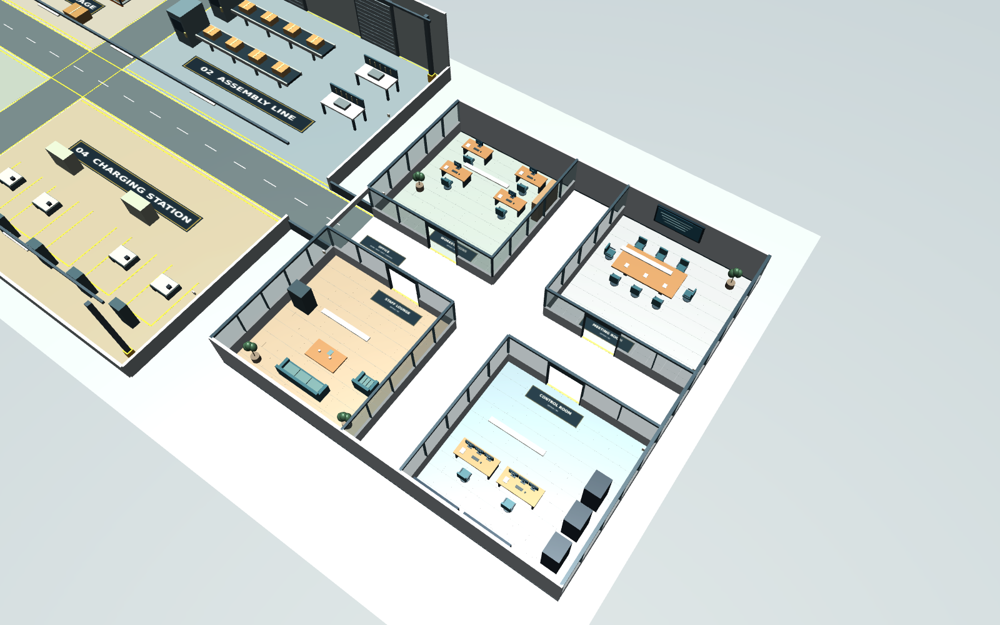

# G1 Warehouse + Office Simulation

**Unitree G1이 대형 창고와 사무실을 실제 보행으로 이동하는 MuJoCo 평가 환경.**


| 항목 | 구성 |
|---|---|
| 실행 환경 | Ubuntu 22.04 / 24.04 · Python 3.10–3.12 · MuJoCo 3.5.0 |
| 로봇 | Unitree 공식 G1 모델 + 사전학습 보행 정책 |
| 보행 | 다리 12관절 토크 제어 · 상체 고정 · 기본 실행 CPU 가능 |
| Warehouse | **48×32m** · 자재 창고 / 조립 라인 / 검사 구역 / 충전 구역 |
| Office | **24×24m** · 업무실 / 회의실 / 휴게실 / 관제실 |
| 연결 | 하나의 물리 장면 · 폭 4m 연결 통로 · 건물 간 보행 가능 |
| 기본 평가 | 의미 구역 순서 → 고정 통로 경로 → waypoint 추종 → 보행 정책 |
| 선택 평가 | RGB 이력 + 언어 지시 → NaVILA → 이동 목표 → 보행 정책 |

## 설치·업데이트

```bash
sudo apt update
sudo apt install -y git python3-venv python3-dev build-essential libgl1 libglfw3 libosmesa6
git clone https://github.com/alsgyu/G1-sim-test.git
cd G1-sim-test
bash scripts/setup.sh
source .venv/bin/activate
```

- 첫 설치: 고정 버전의 공식 로봇 모델·메시·정책 다운로드.
- 기본 실행: Isaac Gym / ROS 2 / CUDA 불필요.
- 기존 설치: 저장소에서 `git pull` → `bash scripts/setup.sh` → `source .venv/bin/activate`.
- 이전 `bays` 설정은 새 `zones` 설정으로 변경. 직접 수정한 YAML은 [FACTORY.md](docs/FACTORY.md) 기준으로 이전.

## 바로 실행

```bash
# 창을 열고 G1의 창고 4구역 보행 관찰
python -m g1_factory.run

# Office 4개 방 순회
python -m g1_factory.run --scenario office_tour

# Warehouse → Office 이동
python -m g1_factory.run --scenario warehouse_to_office

# 전체 8구역 순회, 전체 장면 카메라
python -m g1_factory.run --scenario full_tour --camera overview

# 원하는 의미 구역 순서 지정
python -m g1_factory.run --zone-route material_storage assembly_line inspection charging
```

**명령 한 번으로 MuJoCo 창이 열리고 G1이 걸어갑니다.** 사전학습 정책의 관절 제어와 물리 시뮬레이션으로 이동합니다.



| 창 조작·표시 | 기능 |
|---|---|
| `1` / `2` / `3` | 전체 장면 / G1 따라가기 / G1 1인칭 |
| `Space` | 일시정지·재개 |
| 화면 정보 | 실행 모드 · 시나리오 · 현재 구역 · waypoint 진행 · 최근 NaVILA 응답 |
| 오른쪽 위 미니맵 | 전체 8구역·통로·경로 · 주황색 G1 위치·방향 · 현재 좌표 |
| 초기 시점 | `--camera overview`, `follow` 또는 `ego`; 기본 `follow` |
| 화면 없는 실행 | `--headless` |

- 기본 GUI: MuJoCo 뷰어 + 상태 표시. 별도 웹 대시보드·채팅 입력창은 없음.
- 언어 지시: 실행할 때 `--instruction`으로 전달. NaVILA 서버 설정은 [VLN.md](docs/VLN.md).
- 창 실행: Ubuntu 데스크톱 필요. 일반 SSH 서버: `--headless`로 평가·이미지 저장.
- 기본 최대 시간: 경로 길이에 따라 자동 설정. `--duration 120`으로 120초 상한 지정 가능.

## 4구역의 의미와 연구실 배정

**Warehouse의 4구역은 서로 다른 공장 기능입니다. Office도 4개의 별도 방으로 구성됩니다.**

| 환경 | 구역 ID | 용도·시설 |
|---|---|---|
| Warehouse | `material_storage` | 자재 창고 · 높은 적재 선반·팔레트·박스 |
| Warehouse | `assembly_line` | 조립 라인 · 컨베이어·작업대 |
| Warehouse | `inspection` | 검사 구역 · 검사 설비·작업대 |
| Warehouse | `charging` | 충전 구역 · 도킹·충전 설비 |
| Office | `office_workstations` | 업무실 · 책상·모니터·의자 |
| Office | `office_meeting` | 회의실 · 회의 테이블·의자·화면 |
| Office | `office_lounge` | 휴게실 · 소파·커피 테이블·자판기 |
| Office | `office_control` | 관제실 · 다중 모니터·서버 랙 |





| 연구실 프리셋 | 기본 시나리오 | 실행 범위 |
|---|---|---|
| `lab_a` | `warehouse_tour` | Warehouse 4구역 |
| `lab_b` | `office_tour` | Office 4개 방 |
| `lab_c` | `warehouse_to_office` | 창고 → 사무실 |
| `lab_d` | `full_tour` | 전체 8구역 |

- 예: `python -m g1_factory.run --lab lab_b`.
- 연구실별 **실험 프리셋** 배정. 건물 복제·사용자 접근 권한 기능은 없음.
- 각 연구실이 별도 프로세스로 실행하면 동일 환경에서 독립 실험 가능. 프로세스당 G1 한 대.
- `--lab`, `--scenario`, `--zone-route` 중 하나 선택.
- `--zone-route`는 첫 구역에서 시작하여 뒤의 구역들을 순서대로 방문. 최소 2구역.
- 선반 이동·온도계 설치·시나리오 변경: [FACTORY.md](docs/FACTORY.md).

## 평가·이미지 저장

```bash
# 사용 가능한 시나리오·구역 보기
python -m g1_factory.run --list-scenarios

# 화면 없이 평가
python -m g1_factory.run --scenario warehouse_tour --headless

# G1 시점 RGB·깊이 저장: GPU 없는 서버
MUJOCO_GL=osmesa python -m g1_factory.run --scenario office_tour --headless --record

# 실제 MuJoCo 장면의 전체·창고·사무실·G1 시점 이미지 저장
MUJOCO_GL=osmesa python scripts/render_scene.py --scenario warehouse_tour
```

결과: `outputs/<실행명>/`. 직접 지정: `--output outputs/my_run` — 새 폴더만 허용.

| 파일 | 내용 |
|---|---|
| `summary.json` | 성공·목표 오차·경로 오차·충돌·넘어짐·구역 방문·모델/설정 해시 |
| `trajectory.csv` | 위치·방향·속도 명령·경로 오차 |
| `zone_events.json` / `scenario.json` | 구역 진입 시각·위치 / 시작점·방문 순서·기준 경로 |
| `actions.json` | NaVILA 응답·동작·추론 지연; 기본 경로 모드에서는 빈 목록 |
| `temperature.json` | 온도계별 합성 온도값 |
| `frames/` | `--record` 사용 시 RGB PNG·미터 단위 깊이 NPY |
| `config.yaml` / `scene.xml` | 실행 설정·장면. 메시 경로는 로컬 절대 경로 |

- 기본 성공: waypoint 완주 + 지정 구역 순서 충족 + 충돌·넘어짐 없음. 목표 허용 오차 0.3m.
- 종료 코드: 성공 `0`, 실패·시간 초과 `1`.
- 경로는 고정 중앙 통로 그래프 사용. 장애물 회피·SLAM·학습형 경로 계획은 후속 연구 대상.
- 창고·사무실은 직접 생성한 시뮬레이션 지오메트리. 제조 공정·배터리 충전·열전달 물리는 미구현.

## VLN·연구 확장

- 기본 경로 추종은 즉시 실행 가능. **경로 추종 점수는 VLN 점수가 아님.**
- NaVILA: 설치 스크립트·모델 호출 어댑터 제공. NVIDIA GPU 모델 추론·공장 VLN 성능은 미검증.
- VLN 실행·평가 목표 설정: [VLN.md](docs/VLN.md).
- 구역 간 경로 교체: `g1_factory/routes.py`.
- 추종 제어 교체: `g1_factory/navigation.py`.
- 보행 정책 교체: `g1_factory/locomotion.py`. 관측·관절 순서 일치 필요.
- 위치 추정: 시뮬레이터 정답 pose. SPL·nDTW는 지시문·정답 경로 데이터셋 구성 후 확장.

[검증 결과](docs/VALIDATION.md) · [환경 변경](docs/FACTORY.md) · [도구·모델 선정](docs/DECISIONS.md) · [출처·라이선스](THIRD_PARTY.md)
