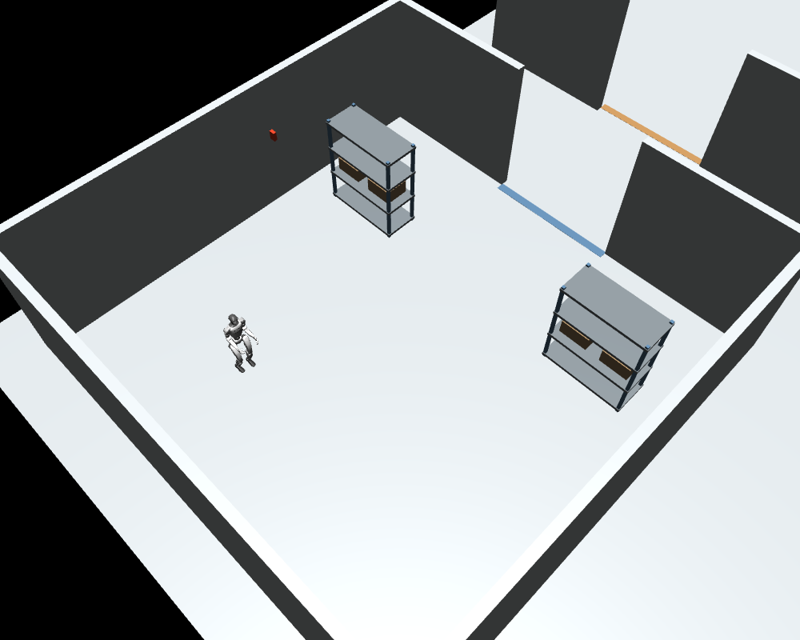

# G1 Factory Simulation

**목표:** 공장 안에서 Unitree G1이 정해진 경로를 실제 보행으로 추종하는 평가 환경.



| 항목 | 구성 |
|---|---|
| OS | Ubuntu 22.04 / 24.04, Python 3.10–3.12 |
| 시뮬레이터 | MuJoCo 3.3.7 |
| 로봇·보행 | Unitree 공식 G1 XML + 사전학습 TorchScript 정책 |
| 관절 | 다리 12 DOF, 상체 고정 |
| 공장 | 8×8m 구역 4개 + 3m 공용 통로 |
| 기본 입력 | 미리 정한 waypoint 경로 |
| 선택 입력 | NaVILA 영상·언어 모델의 이동 제안 |
| 기본 실행 | CPU 가능, 보행 재학습 불필요 |

## 1. 설치

```bash
sudo apt update
sudo apt install -y git python3-venv python3-dev build-essential libgl1 libglfw3 libosmesa6
git clone https://github.com/alsgyu/G1-sim-test.git
cd G1-sim-test
bash scripts/setup.sh
source .venv/bin/activate
```

첫 설치 시 공식 로봇 모델·메시·정책 다운로드. 버전은 고정됨. Isaac Gym, ROS 2, CUDA는 기본 실행에 불필요.

## 2. 실행

```bash
# 창을 열고 연구실 A 경로 실행
python -m g1_factory.run --lab lab_a

# 화면 없이 물리·보행 평가
python -m g1_factory.run --lab lab_b --headless

# RGB·깊이 저장: GPU 없는 서버는 소프트웨어 렌더링
MUJOCO_GL=osmesa python -m g1_factory.run --lab lab_a --headless --record

# 연구실별 평가: 한 프로세스에 G1 한 대
for lab in lab_a lab_b lab_c lab_d; do
  python -m g1_factory.run --lab "$lab" --headless || break
done

# 공장 전체·구역·로봇 시점 미리보기 저장
MUJOCO_GL=osmesa python scripts/render_scene.py
```

- `--duration 120`: 최대 시뮬레이션 시간(초).
- `--config configs/factory.yaml`: 공장·경로 설정.
- `--output outputs/my_run`: 새 결과 폴더. 기존 폴더 덮어쓰기 금지.
- 성공 시 종료 코드 `0`, 실패·시간 초과 시 `1`.
- 창 실행: Ubuntu 데스크톱 필요. SSH 서버: `--headless` 사용.

## 3. 결과 확인

`outputs/<실행명>/`에 저장.

| 파일 | 내용 |
|---|---|
| `summary.json` | 완주, 목표 오차, 경로 오차, 충돌, 넘어짐, 모델·설정 해시 |
| `trajectory.csv` | 위치·방향·속도 명령·경로 오차 |
| `temperature.json` | 고정 온도계들의 가상 온도값 |
| `frames/` | `--record`일 때 RGB PNG·미터 단위 깊이 NPY |
| `config.yaml` | 실행에 사용한 설정 복사 |
| `scene.xml` | 해당 실행의 공장·G1 장면, 메시 경로는 로컬 절대 경로 |

기본 성공: **모든 waypoint를 순서대로 통과 + 충돌·넘어짐 없음**. 목표 허용 오차 0.3m.

## 4. 공장 수정

`configs/factory.yaml` 수정 후 재실행.

| 설정 | 변경 내용 |
|---|---|
| `bays[].lab` | 연구실 이름 |
| `bays[].spawn` | 시작 x, y, yaw |
| `bays[].waypoints` | 경로 x, y 목록 |
| `bays[].shelves` | 선반 추가·삭제·위치·크기·회전 |
| `bays[].sensors` | 온도계 추가·위치·높이 |
| `bays[].hotspots` | 가상 열원 위치·온도 상승·범위 |

- 좌표: 각 구역 중심 기준, 미터. 회전: 라디안.
- `&shelves` / `*shelves`: 공통 설정. 연구실별로 다르게 쓰려면 해당 별칭을 독립 목록으로 교체.
- 선반: 배치 이동 가능. 로봇이 밀거나 집는 조작은 별도 구현 필요.
- 온도계: 위치 표시 + 합성 온도값. 열전달·실제 센서 오차 물리 모델은 미구현.
- 연구실 구분: 물리 구역·설정 단위. 사용자 인증이나 접근 권한 기능은 없음.
- 네 구역은 한 장면에 존재. 기본 G1은 선택한 구역 한 곳만 평가. 다중 로봇 동시 제어는 후속 작업.

자세한 배치·이동 API: [FACTORY.md](docs/FACTORY.md).

## 5. VLN·연구 확장

- 바로 실행: 고정 경로 → waypoint 추종 → 기존 보행 정책 → MuJoCo.
- 선택 실행: RGB 이력 + 언어 지시 → NaVILA → 상대 이동 목표 → 기존 보행 정책.
- NaVILA 설치·실행: [VLN.md](docs/VLN.md). 별도 NVIDIA GPU 환경 필요.
- 경로 계획 교체: `g1_factory/navigation.py`.
- 보행 정책 교체: `g1_factory/locomotion.py`. 관측·관절 순서 일치 필수.
- 기본 위치 추정: 시뮬레이터 정답 pose. SLAM·시각 위치 추정 성능은 평가하지 않음.
- 기본 경로 추종 결과는 **VLN 성능 결과가 아님**. SPL·nDTW 등은 별도 지시문·정답 데이터셋 구성 후 추가.

```bash
# NaVILA 서버 실행 후. --goal-local은 평가용 정답이며 모델 입력으로 제공하지 않음.
MUJOCO_GL=osmesa python -m g1_factory.run --lab lab_a --headless \
  --navila-url http://127.0.0.1:54321 \
  --instruction "Walk toward the shelves and stop in the open space in front of them." \
  --goal-local 0 1
```

VLN 성공: 모델이 정지하고 지정 목표 0.5m 이내 + 충돌·넘어짐 없음. 예제 지시·목표 쌍은 연결 확인용이며 검증된 벤치마크 데이터가 아님.

## 6. 검증·선정 근거

```bash
python -m pytest -q
```

[검증 결과](docs/VALIDATION.md) · [도구·모델 선정](docs/DECISIONS.md) · [출처·라이선스](THIRD_PARTY.md)
