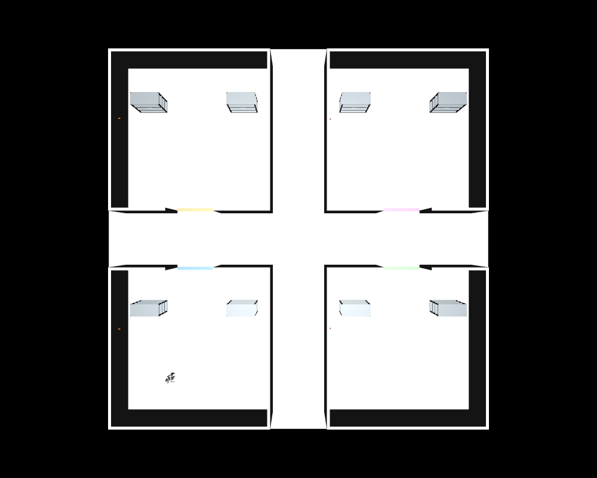

# 공장 구성·변경

## 환경을 구하는 방법

**현재:** Python이 MJCF 공장을 직접 생성. 외부 공장 에셋 다운로드 불필요.



- 8×8m 구역 4개. 가운데 3m 십자 통로.
- 구역마다 벽·출입구·선반 2개·온도계 1개·가상 열원.
- 연구실별 동일한 기본 배치. 설정 변경으로 서로 다른 실험 가능.
- 시각 품질은 단순화되어 있음. 실제 공장 영상과의 차이는 VLN 평가 시 고려.

| 구역 | 격자 위치 | 중심 좌표(m) | 기본 담당 |
|---|---|---|---|
| `lab_a` | `[0,0]` | `[-5.5,-5.5]` | Laboratory A |
| `lab_b` | `[1,0]` | `[5.5,-5.5]` | Laboratory B |
| `lab_c` | `[0,1]` | `[-5.5,5.5]` | Laboratory C |
| `lab_d` | `[1,1]` | `[5.5,5.5]` | Laboratory D |

## 선반 이동

일반 사용: YAML의 `position`, `yaw` 수정 → 재실행.

Python API 사용: 실행 중 선반의 mocap 위치 변경 가능.

```python
from g1_factory.scene import move_shelf

# model, data, metadata는 build_scene와 MjModel/MjData로 준비
move_shelf(model, data, metadata, "lab_a", "west", [-2.0, 2.0], yaw=0.0)
```

- 단위: 구역 중심 기준 m, yaw는 rad.
- mocap: 편집자가 배치하는 고정 장애물. 동적 밀기·파지와 다름.
- 이동 후 경로 재계획은 자동 제공되지 않음.
- GUI에서 끌어 배치하는 전용 편집기는 없음.
- 다른 선반·로봇과 겹치지 않게 배치. 실행 중 배치 변경 실험은 별도로 기록.

## 온도계 설치

```yaml
sensors:
  - id: thermometer_2
    position: [1.0, 3.5, 1.4]
```

- 장면에 표식 추가. `temperature.json`에 ID·위치·온도 기록.
- 가상 온도: 주변 온도 + Gaussian 열원 + 주기 변화.
- 열전달·유체·적외선 카메라·눈금 OCR 미구현.
- 센서값은 평가 로그. 현재 NaVILA 입력은 RGB와 언어이며 온도 JSON을 제공하지 않음.

## 실제 공장 에셋으로 확장

| 출처 | 형식 | 적용 방법 |
|---|---|---|
| [NVIDIA 공식 창고·환경](https://docs.isaacsim.omniverse.nvidia.com/latest/assets/usd_assets_environments.html) | USD | Isaac Sim 확장 시 유리. 현재 MJCF에 바로 넣는 기능은 제공하지 않음 |
| [AWS RoboMaker Small Warehouse](https://github.com/aws-robotics/aws-robomaker-small-warehouse-world) | Gazebo SDF·메시 | 메시와 충돌 형상을 검토 후 MJCF로 재구성 |
| 연구실 보유 CAD/도면 | CAD·OBJ·STL 등 | 단위·축·충돌 형상 단순화 후 MJCF mesh/geom으로 배치 |

외부 에셋 도입 시 각 메시·텍스처의 라이선스 확인. 현재 배치는 직접 생성하므로 외부 공장 에셋 라이선스에 의존하지 않음.
