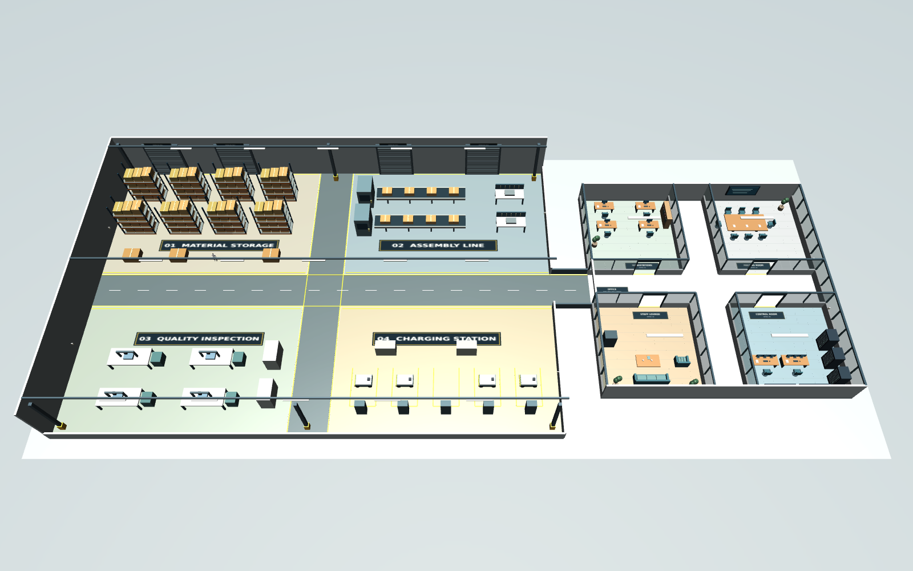

# Warehouse·Office 구성과 변경

## 공간 구성

**Warehouse 1개 + Office 1개를 같은 MuJoCo 세계에 배치합니다.**



| 공간 | 크기·위치 | 구성 |
|---|---|---|
| Warehouse | 48×32m · 중심 `[0, 0]` | 자재 창고 / 조립 라인 / 검사 구역 / 충전 구역 |
| Office | 24×24m · 중심 `[40, 0]` | 업무실 / 회의실 / 휴게실 / 관제실 |
| 연결 통로 | `x=24..28`, `y=-2..2` | 폭 4m · 건물 간 보행 연결 |
| 내부 통로 | 폭 4m | 구역·방 출입구를 연결하는 공용 동선 |

- Warehouse: 적재 선반·팔레트·박스·컨베이어·검사 설비·충전 설비로 용도 구분.
- Office: 벽·출입구로 4개 방 구분. 책상·회의 테이블·소파·관제 콘솔 배치.
- 전체 보기: 내부가 보이도록 지붕 생략. Warehouse 외벽 일부는 낮춘 단면 표현.
- 설비는 시각적 표식과 충돌 형상. 실제 조립·컨베이어 이송·충전 공정은 구현하지 않음.
- 형상·표지판은 코드로 직접 생성. 별도 Warehouse/Office 에셋 다운로드 불필요.

## 연구실과 의미 구역

이전 버전의 `lab_a`~`lab_d`는 동일한 작은 물리 구역이었습니다. 현재는 아래 **실험 시나리오 프리셋**입니다.

| 프리셋 | 시나리오 |
|---|---|
| `lab_a` | `warehouse_tour` |
| `lab_b` | `office_tour` |
| `lab_c` | `warehouse_to_office` |
| `lab_d` | `full_tour` |

- Warehouse의 네 기능 구역은 모든 연구실이 같은 설정으로 사용 가능.
- 독립 실행: 연구실마다 별도 프로세스·설정 파일·출력 폴더 사용.
- 사용자 인증·독점 구역·멀티 로봇 동시 실행은 제공하지 않음.

## 구역 이동 시나리오

```bash
# 자재 창고 → 조립 라인 → 검사 구역 → 충전 구역
python -m g1_factory.run --zone-route material_storage assembly_line inspection charging

# 자재 창고 → 사무실 관제실
python -m g1_factory.run --zone-route material_storage office_control

# 업무실 → 회의실 → 휴게실 → 관제실
python -m g1_factory.run --scenario office_tour
```

- 첫 구역의 `goal` 좌표에서 시작 → 다음 구역의 `goal`을 순서대로 방문.
- 구역 간 중앙 통로를 경유하는 고정 경로. 장애물에 막힌 경로는 오류로 알림.
- 구역 입장 시각·위치는 `zone_events.json`, 지정 방문 순서 달성 여부는 `summary.json`에 기록.
- 선반 이동 후 자동 우회·재계획 기능은 없음. 경로 계획 연구는 `g1_factory/routes.py`에서 확장.

## YAML 편집

`configs/factory.yaml` 수정 후 재실행. 좌표는 모두 **세계 좌표·미터**, `yaw`는 **라디안**.

| 설정 | 의미 |
|---|---|
| `zones[].id`, `label`, `kind` | 구역 ID·표시명·`warehouse` 또는 `office` |
| `zones[].bounds` | `[xmin, ymin, xmax, ymax]` 구역 범위 |
| `zones[].center`, `goal` | 구역 중심·로봇 방문 목표 `[x, y]` |
| `zones[].shelves` | 선반 ID·위치 `[x, y]`·크기 `[폭, 깊이, 높이]`·회전 |
| `zones[].sensors` | 온도계 ID·위치 `[x, y, z]` |
| `zones[].hotspots` | 합성 열원 위치·온도 상승·범위 |
| `scenarios.<이름>` | 순서대로 방문할 구역 ID 목록 |
| `labs.<연구실>.scenario` | 연구실의 기본 시나리오 |

```yaml
# scenarios 아래에 추가
storage_to_control:
  - material_storage
  - office_control
```

실행: `python -m g1_factory.run --scenario storage_to_control`.

- `--config configs/my_experiment.yaml`로 연구실별 설정 선택 가능.
- 건물 크기·통로 폭은 현재 구조 코드와 함께 고정. `layout` 숫자만 바꿔 구조를 확대하는 기능은 없음.
- 건물 구조: `g1_factory/scene.py`, Office 가구·벽: `g1_factory/office.py`.
- 선반·센서·열원은 YAML로 변경. 컨베이어·검사 설비·Office 가구 배치는 위 코드에서 변경.
- 이전 버전의 구역별 로컬 좌표와 `bays` 설정은 지원하지 않음.

## 선반 이동

- 일반 사용: `zones[].shelves[].position`, `yaw` 수정 → 재실행.
- 실행 중 배치 변경: `g1_factory.scene.move_shelf` API.
- 선반은 mocap으로 위치를 지정하는 고정 장애물. 로봇의 밀기·파지는 별도 구현 필요.
- GUI에서 마우스로 끌어 배치하는 전용 편집기는 없음.
- 선반끼리·벽·로봇과 겹치지 않도록 설정. 이동 후 경로 유효성 재확인 필요.

```python
from g1_factory.scene import move_shelf

# model, data, metadata는 장면 로드 시 생성한 객체
# 좌표는 세계 기준 [x, y]; 선반 ID는 YAML에서 확인
move_shelf(model, data, metadata, "material_storage", "r01", [-20.0, 10.0], yaw=0.0)
```

## 온도계 설치

대상 구역의 `sensors` 목록에 추가:

```yaml
sensors:
  - id: thermometer_extra
    position: [-22.0, 10.0, 1.5]
```

- 예시 위치: 자재 창고 내부, 높이 1.5m. 다른 구역은 해당 `bounds` 안에 배치.
- 장면 표식 + `temperature.json`에 센서 ID·위치·합성 온도 기록.
- 합성 온도: 주변 온도 + Gaussian 열원 + 주기 변화.
- 열전달·유체·실제 센서 오차·적외선 카메라·눈금 OCR은 미구현.
- NaVILA 입력은 RGB와 언어. 온도 JSON은 평가 로그이며 모델 입력에 포함하지 않음.

## 외부 에셋으로 확장

현재 장면은 직접 생성한 형상입니다. 실제 창고와의 시각적 차이를 줄이려면 외부 메시를 변환해 적용할 수 있습니다.

| 출처 | 형식 | 적용 방법 |
|---|---|---|
| [AWS RoboMaker Small Warehouse](https://github.com/aws-robotics/aws-robomaker-small-warehouse-world) | Gazebo SDF·메시 | 메시·텍스처 이용 조건 확인 → 단위·축 정리 → MJCF 배치·충돌 형상 작성 |
| [NVIDIA 공식 창고·환경](https://docs.isaacsim.omniverse.nvidia.com/latest/assets/usd_assets_environments.html) | USD | Isaac Sim 확장 후보. 현재 MJCF에 직접 불러오는 기능은 없음 |
| 연구실 CAD·도면 | CAD·OBJ·STL 등 | 메시 변환 → 축·크기 보정 → 충돌 형상 단순화 |

외부 에셋 도입 시 개별 메시·텍스처의 라이선스 확인. 센서·구역 ID·시나리오 인터페이스를 유지하면 보행·VLN 연결을 재사용할 수 있습니다.
